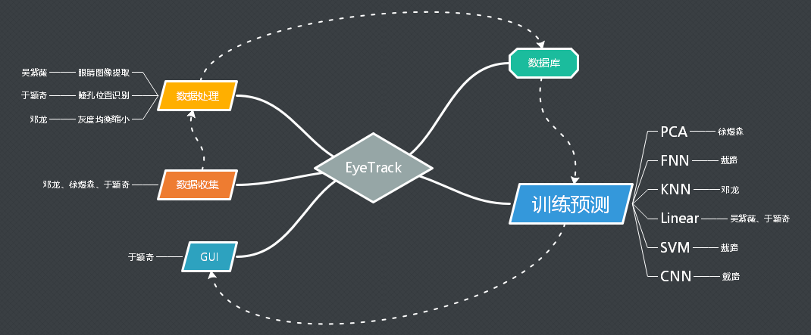
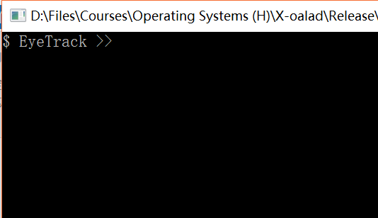
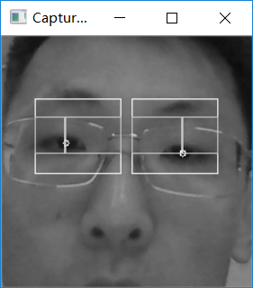
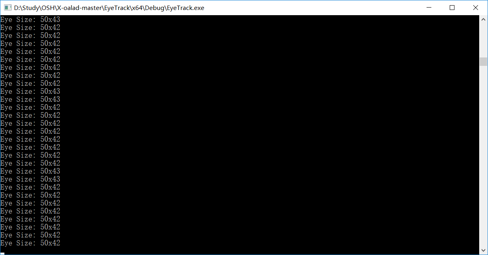
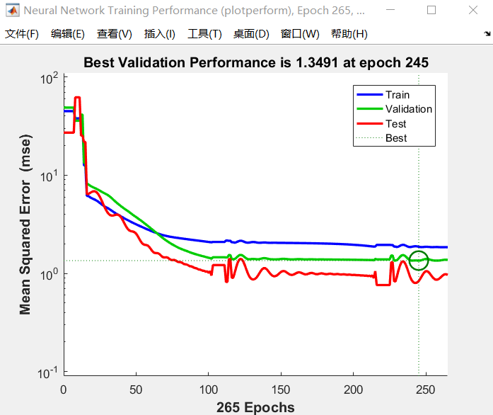

# 眼动追踪项目详细设计报告

## 1.引言

### 1.1. 编写目的

编写本报告的目的是为了使用户和其他开发人员对本项目的基本情况有一个共同的理解，并以此作为其他开发者进行删改或增加额外设计、用户进行使用的依据，以及对项目的功能、性能和运行环境的要求。 

本设计报告也作为本学期整个项目的总结，详细介绍了项目整体的设计情况。分为引言、总体设计、模块设计、数据库设计四大部分对整体项目进行十分详细的介绍。

另外，也作为后期维护或增改的参考资料。

### 1.2.项目概述

本项目全称为“眼动追踪技术新方法及其在人机交互中的应用”。本项目建立了一个低成本的新方式，利用设备摄像头，对用户的视线信息做出分析，提取出有效信息作为机器输入，从而作为一种新的机器控制方法。具体地说，我们能从用户眼部信息中，实时的定位用户关注的屏幕区域、提供辅助阅读等功能。
我们克服了目前眼动追踪技术中设备成本高、便携性差的问题，制作出了一个无需独立外设的眼动追踪实现方案。另外，我们的方法足够简单，能够用一个精简的驱动乃至集成至操作系统中实现，而无需消耗巨大的计算资源。
对于精确性和采样频率，我们以实用性为标准，在能保证使用的情况下尽可能地节约了计算资源。

### 1.3.概念简述

#### 1.3.1.眼球追踪

眼球跟踪(Eye tracking)是测量注视点（人眼看的地方）或眼睛相对于头部的运动的过程。眼动仪是用来测量眼睛位置和眼球移动的装置。眼睛检测和跟踪研究侧重于两个领域：图像中的眼睛定位(eye localization)和注视跟踪(gaze estimation)。

#### 1.3.2.人机交互

人机互动（英语：human–computer interaction，缩写：HCI，或 human–machine interaction，缩写：HMI），是一门研究系统与用户之间的交互关系的学问。系统可以是各种各样的机器，也可以是计算机化的系统和软件。人机交互界面通常是指用户可见的部分。用户通过人机交互界面与系统交流，并进行操作。 

## 2.总体设计

### 2.1.系统运行环境

#### 2.1.1. 开发环境

操作系统：Windows 10 家庭中文版 64位 (10.0 版本 1607)
IDE：Microsoft Visual Studio Community 2017  
编译器或解释器：

* 1. Visual C++ 2017
* 2. Visual C# 2017
* 3. Python 3.5.1
* 4. Matlab R2017a

框架：

* 1. Microsoft .NET Framework 4.5.1  (版本 4.6.01586)

库：

* 1. Opencv 3.4.1
* 2. Opencv-python 
* 3. Dlib
* 4. Numpy
* 5. Panda

#### 2.1.2. 运行环境

本软件全体可运行在Windows环境中，运行需依赖

* 1. Microsoft .NET Framework 4.5.1  (版本 4.6.01586)
* 2. python 3.5.1 或更高版本
* 3. panda、numpy、dlib、opencv-python
* 4. MATLAB R2017a 或更高版本

软件核心部分（数据处理、瞳孔定位、线性回归）可运行在任意平台，依赖

* 1. python 3.5.1 或更高版本
* 2. panda、numpy、dlib、opencv-python
* 3. MATLAB R2017a或更高版本

### 2.2.系统设计模型

### 2.3.项目功能描述

本程序可调用摄像头，收集、处理眼部图片；完成多种针对眼部图片训练和预测方法；利用训练模型进行简单的可视化展示。

### 2.4.项目结构及人员分工

### 2.5.技术路线

* 1. 使用 opencv 和 dlib 库截取眼睛图片并通过 dlib库特征点识别即梯度方法计算瞳孔坐标，加线性回归方法计算视线落点
* 2. 使用支持向量机进行对数据的二分类处理，达成初步目标（视线二分类处理）。
* 3. 使用主成分分析对高维数据降维后用神经网络的方法进行学习。
* 4. 使用 K近邻算法 KDtree 进行训练并分类

### 2.6.外部接口（使用说明）

本软件目前仅支持用户手动操作。用户通过主程序EyeTrack输入指令运行不同模块，各模块由对应的GUI操作。

#### 2.6.1.主程序

如图，主程序为一控制台程序。为类命令行模式，可向内输入指令，运行对应模块。目前支持指令如下：

* `show` 运行瞳孔识别demo
* `collect`运行数据收集模块
* `process`运行数据处理模块，将收集到数据截取出眼部图片并标识瞳孔位置
* `zoomDowm`运行数据缩小模块，将收集到的数据均衡化归一化并缩小为3\*5 的图片
* `train`训练模块，可接受参数`knn`、`svm`、`fnn`、`linear`,即训练不同方法所需模型
* `run`运行模块，可接受参数同上，用展示GUI并用对应方法获得结果。

#### 2.6.2.数据收集

这是一个全屏程序，请确认不被其他程序遮挡。程序正常启动后右下角显示下拉菜单及摄像头画面。利用下拉菜单可切换摄像头。使用前请确认摄像头正常运行，并且用户脸部完整出现在画面内。
观察完毕后，按H键可隐藏摄像头画面及下拉菜单。
屏幕中会出现蓝色圆形区域，中间有黑色十字。用户确认自己注释十字后，按下Enter键收集此次数据，并更改圆点位置。
按下Space键可跳过此数据，并更改圆点位置。

#### 2.6.3.其它

程序其它部分均自动运行，无需用户操作。

## 3.模块设计

本部分介绍程序各个模块设计及功能

### 3.1.数据收集

#### 3.1.1.功能

快速收集摄像头获得的画面，及此时对应的注视点。用于大量生成训练数据。

#### 3.1.2.性能

无特定性能要求，根据用户的操作速度决定获取数据的速度。简单测试正常情况下数据获取速度约为3组/秒。
由于调取并显示摄像头画面，占用一定系统资源。

#### 3.1.3.内部接口

数据收集程序为独立程序，不被软件其它部分直接调用。主程序EyeTrack通过操作系统间接打开该程序。
无其它内部接口。

#### 3.1.4.外部贮存结构设计

外存中存储设计参照数据库设计部分。

### 3.2.瞳孔识别展示

#### 3.2.1.功能

展示如何使用opencv库来实现找到瞳孔位置，并把眼睛从摄像头采集到的图像中截取出来。

##### 3.2.1.1采集到的灰度图

##### 3.2.1.2.截取出的眼睛大小

#### 3.2.2.性能

大约每秒可以处理15~20幅采集到的图像，显示出的效果为每秒15帧左右。

若要进行快速响应、高速识别，还需要更高的性能。但这样的性能已经可以满足低速的识别处理的需求，达到项目目的。

眼镜对模块运行无影响。（参见3.2.1.1.节图）

#### 3.2.3.接口

独立函数，无参数。主程序通过直接调用运行，运行时主程序被阻塞。
由用户手动关闭，关闭后主程序继续运行，无反馈。

### 3.3.主成分分析PCA

分为训练部分和降维部分

#### 3.3.1.功能

主成分分析（principal component analysis）是一个种常用的数据分析方法。PCA通过线性变换将原始数据变换为一组个维度线性无关的表示，用于提取数据的主要特征分量，对高维数据（图片）进行降维，同时要保证在降维过程中，没有丢弃重要信息。

主成分分析的训练部分对一组数据进行降维，同时保留求出的降维矩阵，在降维部分使用降维矩阵对传入的单一数据进行降维。

#### 3.3.2.性能

PCA算法的主要部分是矩阵运算，如果有需要可以使用独立显卡进行矩阵运算来加速。

但对于我们而言，我们所需的训练样本并不大，大约只有100张图片（可以让用户很快采集完成），所以矩阵运算量不大。即使不使用独立显卡进行矩阵运算，训练和降维过程也可以很快完成。

#### 3.3.3.接口

Mat为opencv库的一个类型。

本模块所有参数、返回值均为Mat类型。

##### 3.3.3.1.训练部分

调用时参数输入：输入一组数据，假设为n条k维的数据，输入的Mat应为n\*k的矩阵，每一行为一条k维数据。

调用后返回值：返回一个计算好的 2 * k 降维矩阵，此矩阵用于对数据进行降维。

##### 3.3.3.2.降维部分

调用时参数输入：第一个参数为待降维的数据（n \* k），第二个参数为降维矩阵（2 \* k）。每条待降维数据都应为k维，可以一次降维一条或多条数据。

调用后返回值：返回降维后数据（n * 2），每条数据降维后均为2维。

### 3.4.眼睛提取

#### 3.4.1.功能

利用opencv库中VideoCapture()获取摄像头视频，读取当前帧后利用`cvtColor()`函数将输入的图片转化为灰度图，利用Dlib库中的`get_frontal_face_detector`函数确定人脸数，再标定人脸的关键特征点并基于此截取人的左右眼的图片，分别保存到文件中。

#### 3.4.2.性能

shape_predictor_68_face_landmarks.dat是Dlib官方训练好的模型，利用这个 `shape_predictor`函数对人脸的68个特征点先进行标注，再从中截取人眼关键点对应的部分，基于目前的各种加了干扰的测试，准确率达100%.  由于人眼关键点与人眼边缘部分不是完全贴合，经过手动调整，对于1280\*720的人脸图片而言，将误差控制在横向纵向5个像素的误差。

#### 3.4.3.接口

输入为摄像头视频。

输出为依次截取到的眼睛的图片，每张人脸图片对应的左右眼图片分别存到不同的文件夹下。

#### 3.4.4.重要函数

通过opencv库中的`VideoCapture()`获得摄像头视频，再利用`cap.read()`读取帧。

利用Dlib库中的`get_frontal_face_detector`函数确定人脸数，再利用`shape_predictor`对人脸关键特征点进行标注，并基于这些关键点设定眼睛边框的参数。

利用`img[eyeup:eyedown,eyel:eyer]`截取人眼部分，再写入文件。

### 3.5.瞳孔位置识别

#### 3.5.1.功能
输入眼睛图片，使用opencv函数库中resize()函数改变图片大小，cvtColor()转化为灰度图，以及其他的函数寻找图中颜色梯度最高的位置，该位置即为所要寻找的瞳孔位置，输出瞳孔在图片中对应的像素位置到对应的文件中。

#### 3.5.2.性能
算法的核心部分为寻找图片中颜色变化速度最快的位置，该函数的精度与图片的质量密切相关，经过测试通过电脑自带摄像头在光线相对较差的情况下，所标定的瞳孔位置，与真实位置差距在2像素以内（截取的眼睛图片的大小约为50*20）性能基本满足要求

#### 3.5.3.接口
调用时需要在该模块所在文件夹中存在一个文件夹eyedetect存储所要处理的眼睛图片，眼睛图片的命名方式为left0.png,left1.png,……表示左眼图片以及right0.png,right1.png,……表示右眼图片。

输出时将各所采集到的眼睛位置信息依次输出到该模块所在文件夹中的left.txt以及right.txt中

#### 3.5.4.重要函数
* cv::Point findEyeCenter(cv::Mat eyeROIUnscaled)

  输入Mat矩阵为所要处理的图片矩阵。
  在其中调用各函数对图片进行一系列处理找到瞳孔位置
* void scaleToFastSize(const cv::Mat &src, cv::Mat &dst)
  
  输入的Mat矩阵src为所要处理的图片矩阵。dst为通过调用resize函数改变图片大小后输出的图片矩阵
* cv::Mat computeMatXGradient(const cv::Mat &mat)

  输入为scaleToFastSize处理好的图片矩阵，计算其中各点的梯度大小
  
### 3.6.神经网络

#### 3.6.1.功能

分为训练和预测两部分。训练部分输入一大样例集（每个样例包含一张3\*5的图片，结果包含两个数字），输出训练好的模型。
预测部分输入单张图片，输出模型计算的对应结果。

#### 3.6.2.性能

损失曲线如图

#### 3.6.3.接口

接口同PCA部分。

### 3.7.线性回归

线性回归模块将计算方法从NN更改为线性回归算法，其余部分皆与神经网络部分一致。

## 4.数据库设计

数据库中存储了所收集到的图片以及屏幕中对应位置生成点的对应关系。数据库中含有以下3个文件夹以及3个文本文档。
* sampleSize.txt中仅含有一个数字，存储了数据中的样本数量。
* position 文件夹用于存储样本中随机点的位置，其中包含若干个文本文档，名称为1.txt,2.txt,……每个文本文档中的数据格式为“数字 数字”用于表示屏幕上点所在的位置，如在第54个测试数据中，屏幕中生成的随机点像素位置为（456,297），则在54.txt中存储的信息为

       456 297
* picture文件夹中存储的为由摄像头获取的人脸图片，其中的文件名称为“数字.bmp”，如对应第54组实验数据的图片为“54.bmp”。
* eyedetect文件夹用于存储由picture文件夹中所截取的眼睛图片，其中文件的名称为“left数字.bmp”以及“right数字.bmp”分别表示从picture对应图片中所截取的左眼以及右眼图片。如第54张图片所截取的左眼图片名为“left54.bmp”,第54张图片所截取的右眼图片名为“right54.bmp”。
* eyedetect 用于存储截取的眼睛图片
  *left.txt 用于存储由eyedetect存储采集到的所有的左眼瞳孔的位置信息,即左眼瞳孔在对应眼睛图片中的位置存储的信息格式为“数字\t数字\n”。如第54张图片左眼瞳孔在left54.bmp中(23,15)位置处，则在left.txt中第55行存储的信息为

       23  15

* right.txt 用于存储采集到的右眼瞳孔的位置信息，与left.txt格式类似

## 参考资料

[1]Yongjun Z X Z H R. A Review of Eye Tracker and Eye Tracking Techniques [J]. Computer Engineering and Applications, 2006, 12: 034.

[2]Rayner K. Eye movements in reading and information processing: 20 years of research[J]. Psychological bulletin, 1998, 124(3): 372.