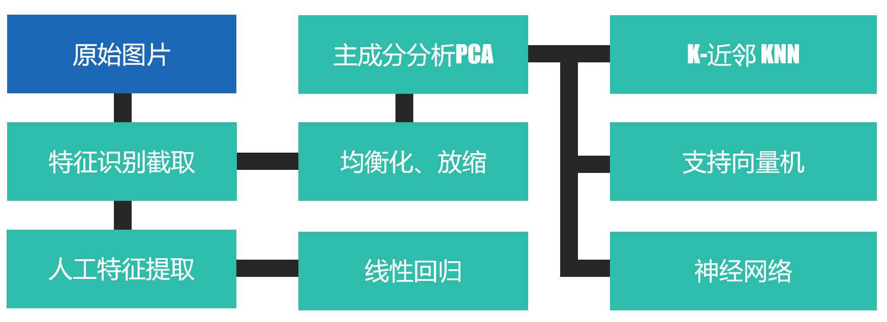
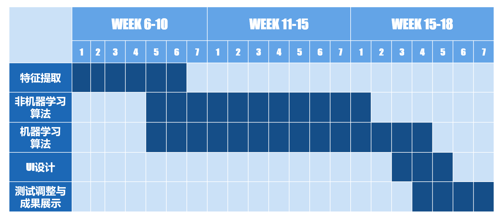
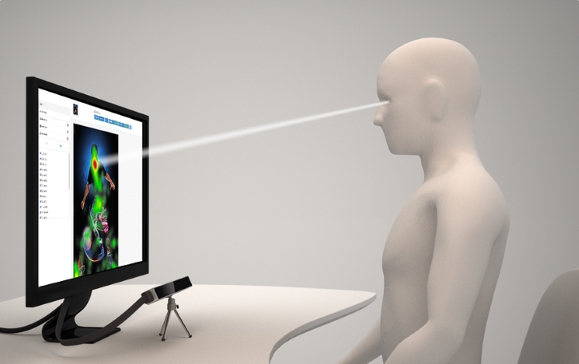
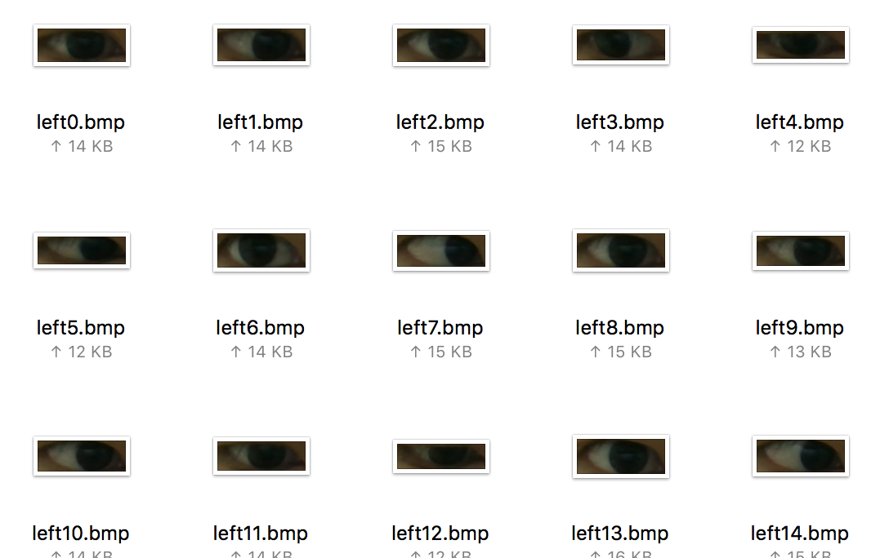

# 眼动追踪详细设计报告

### 目录

一、项目简介

二、总体结构

三、研究方法

四、成果展示

五、改进设想

## 一、项目简介

### 1. 概念简述

#### 1.1 眼球追踪

眼球跟踪(Eye tracking)是测量注视点（人眼看的地方）或眼睛相对于头部的运动的过程。眼睛检测和跟踪研究侧重于两个领域：图像中的眼睛定位(eye localization)和注视跟踪(gaze estimation)。

#### 1.2 人机交互

人机互动（human–computer interaction，缩写：HCI，或 human–machine interaction，缩写：HMI），是一门研究系统与用户之间的交互关系的学问。 

### 2. 发展历史

#### 2.1 早期研究

1879-1920。1879年，法国巴黎的眼科医生贾冯发现人们在阅读文字的时候，眼睛的注视点并不是平滑的划过所注视的文字，而是在某一点停留一段时间。1922年，第一台非侵入式的眼动仪由巴斯韦尔在芝加哥发明。 

#### 2.2 快速发展

1970-1998。二十世纪八十年代开始使用眼动追踪来解答人机交互的问题。具体而言，研究人员调查了用户如何在电脑菜单中搜索命令。当时这样主要是为了帮助残疾用户。 

#### 2.3 广泛应用

1998-至今。 眼动追踪技术得到广泛应用。随着计算机计算能力的发展、图像展示的丰富化、交互方式鲁棒性的增强，当前眼动追踪技术在神经科学、心理学、工业工程与人因工程、市场分析和计算机科学等领域有了广泛应用。

### 3. 背景与意义

#### 3.1 选题背景

人机交互方式变迁：从命令行到视窗、从键鼠到触摸。眼动追踪控制可作为下一代人机接口。

视觉作为人感知外界的最重要感觉，在人机交互中不可或缺。在传统的人机交互设备中，视觉仅仅作为机器信息的一种输出方式，其在信息输入方面的作用一方面不被重视，一方面也由于技术原因难以利用。

随着硬件技术（如GPU）和软件技术（如机器学习）的快速进步，以及包括VR、物联网等新的计算设备和概念的提出，眼球追踪作为一种新的人机交互方式，可以预见其的潜力将被逐渐发掘，成为未来人机交互模式中不可缺少的一部分。

眼球追踪是视觉输入方式（也可称视线分析技术）中最基础也是最重要的一部分，可能是下一代人机接口的开创性技术。眼睛的移动反映了人们的思考过程；因此，记录观察者的眼睛移动，可以一个程度的了解观察者在想什么。

#### 3.2 项目目的

本项目旨在建立一个低成本的新方式，利用简单的头戴设备或者桌面设备，对用户的视线信息做出分析，提取出有效信息作为机器输入，从而作为一种新的机器控制方法。

我们希望克服目前眼动追踪技术中设备成本高、便携性差的问题。另外，我们希望方法尽可能的简单，而不是消耗巨大的计算资源。

我们不会将重点放在精确性和高帧率上，原因是目前眼动追踪技术已经足够精确，采样频率也足够高。

#### 3.3 应用前景

开发人机交互，细致的用户界面。

市场研究与消费者调研方面的应用。

运动研究、心理学与神经科学研究、婴幼儿研究、体育运动研究、教育研究、临床研究。

## 二、总体结构

### 2.1 层次

### 2.2 结构

### 2.3 时间表

## 三、研究方法

### 3.1 数据收集

a) 通过定位标记固定头部和设备的相对位置

b) 在屏幕上随机位置显示目标点

c) 测试者确认看向目标点

d) 记录数据，切换到下一个随机点

### 3.2 确定瞳孔

（线性回归）

（待填充）

### 3.3 主成分分析

（待填充）

### 3.4 支持向量机

（待填充，以及放弃原因）

### 3.5 K近邻算法（KD Tree）

（待填充）

## 四、成果展示

### 4.1 数据收集

#### 4.1.1 近百张原始数据

#### 4.1.2 截取瞳孔

#### 4.1.3 瞳孔图像与坐标一一对应

#### 4.1.4 前馈神经网络

#### 4.1.5 特征值与坐标关系

### 4.2 图形用户界面

#### 4.2.1 数据采集界面

（待填充）

#### 4.2.2 使用界面

（待填充）

### 4.3 使用效果展示

（待填充）

## 五、改进设想

### 5.1 同步性

（降低延迟？）

### 5.2 单摄像头的极限

（充分利用单摄像头采集到的图像信息，计算头部运动，倾角，距离）

### 5.3 工程整合

（多种程序设计语言一起工作，整合难如何克服）

### 5.4 结果标准化

（做到一次数据收集，处处使用，人人使用？）

### 5.5 避免过拟合

（待填充）